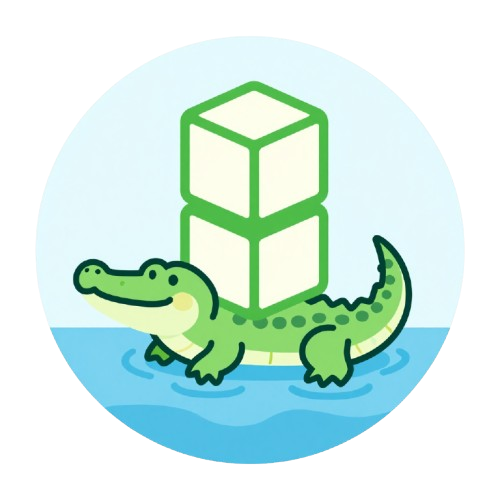

<p align="center">
  
</p>

# gAItor

AI local model asset manager and sync tool. A self-hosted, Docker-based web UI for managing AI model files across a **library** (NAS/source of truth) and one or more **hosts** (inferencing machines).

Think of it as a smart FTP specifically designed for AI models - browse, sync, retrieve from Hugging Face / CivitAI and other URL's, manage with history tracking, and deploy models across your local AI infrastructure.

## Features

- **Library Management** - Centralized model library with metadata, categories (ComfyUI-style), search, and tagging
- **Host Sync** - Copy models to inferencing machines with real-time progress tracking
- **External Retrieval** - Download models from Hugging Face and CivitAI directly into your library
- **Rename Tracking** - Rename models in the library with full history; hosts track rename lineage
- **Web Upload & Scan** - Upload models through the browser or scan for files added directly to storage
- **File Integrity** - SHA-256 hashing for verifying large model file transfers
- **Docker Native** - Single container, volume mounts for library and hosts, PUID/PGID support for NAS

## Quick Start

```yaml
# docker-compose.yml
services:
  gaitor:
    image: ghcr.io/kernelkaribou/gaitor:latest
    container_name: gaitor
    environment:
      - PUID=1000
      - PGID=1000
      - TZ=America/Chicago
      # - HUGGINGFACE_TOKEN=hf_xxxxx
      # - CIVITAI_API_KEY=xxxxx
    ports:
      - "8487:8487"
    volumes:
      - /path/to/nas/models:/library
      - /path/to/local/models:/hosts/local-gpu
      # Add more hosts as volume mounts under /hosts/:
      # - /mnt/laptop/models:/hosts/laptop
      # - /mnt/server2/models:/hosts/server2
    restart: unless-stopped
```

```bash
docker compose up -d
# Open http://localhost:8487
```

### Hosts

Hosts are auto-discovered from subdirectories under `/hosts/` inside the container. Each Docker volume mount creates a host that appears in the UI.

To add a host, mount the remote machine's model directory (via NFS, SMB, or local path) under `/hosts/<name>`:

```yaml
volumes:
  - /path/to/nas/models:/library                  # Source of truth
  - /mnt/gpu-pc/models:/hosts/gpu-pc              # Host 1
  - /mnt/laptop/ai-models:/hosts/laptop           # Host 2
  - /mnt/render-node/models:/hosts/render-node    # Host 3
```

The folder name after `/hosts/` becomes the host name in the UI. No configuration files are needed — just add or remove volume mounts and restart the container.

## Environment Variables

| Variable | Default | Description |
|----------|---------|-------------|
| `PUID` | `1000` | User ID for file operations |
| `PGID` | `1000` | Group ID for file operations |
| `TZ` | `Etc/UTC` | Timezone |
| `PORT` | `8487` | Web UI port |
| `LOG_LEVEL` | `INFO` | Logging level (DEBUG, INFO, WARNING, ERROR) |
| `HUGGINGFACE_TOKEN` | - | Hugging Face API token (for gated models) |
| `CIVITAI_API_KEY` | - | CivitAI API key |

## Development

### Prerequisites
- Python 3.12+
- Node.js 22+
- Docker (for container builds)

### Setup
```bash
# Backend
make setup-backend

# Frontend
make setup-frontend
```

### Run locally
```bash
# Backend (with hot reload)
make dev-backend

# Frontend (with hot reload, separate terminal)
make dev-frontend
```

### Docker development
```bash
make docker-dev
```

### Run tests
```bash
make test
```

## Architecture

- **Backend**: Python 3.12 + FastAPI
- **Frontend**: Svelte 5 + Vite + Tailwind CSS
- **Metadata**: JSON files (no database - network share friendly)
- **Transfers**: Server-side file copy between Docker volume mounts (browser only receives progress updates)

## License

MIT - see [LICENSE](LICENSE)

## Disclosure

It may surprise you I built a local AI model management tool with AI but I did. I had this idea as I was messing with local AI models and passing them across a few machines and wanted a better way to manage it. I did not write the code, ai did, I gave it the idea. I plan to update and keep it functioning as long as I use it and tweak features here and there but its pretty defined scope tool that already went a little overboard. You can do whatever you want with this tool, I dont care. Maybe someone will make something better after seeing this...or already has.