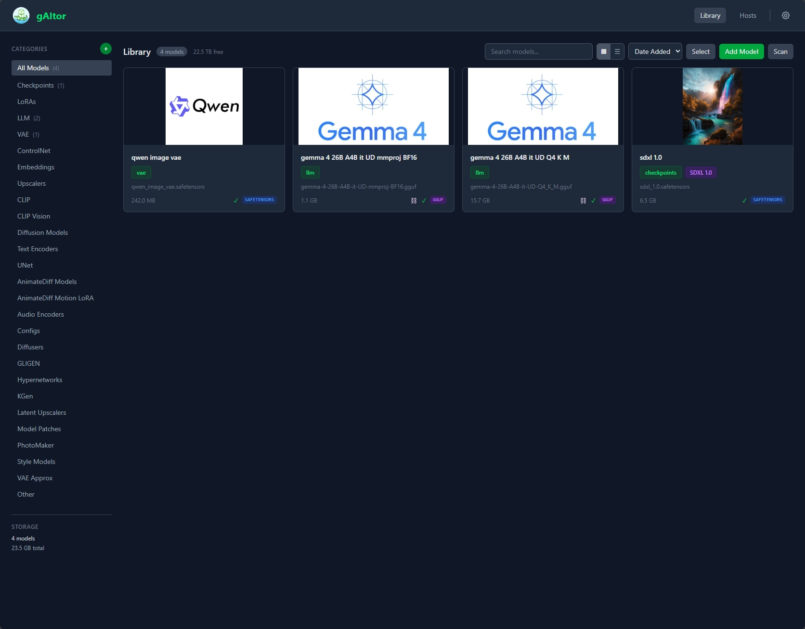
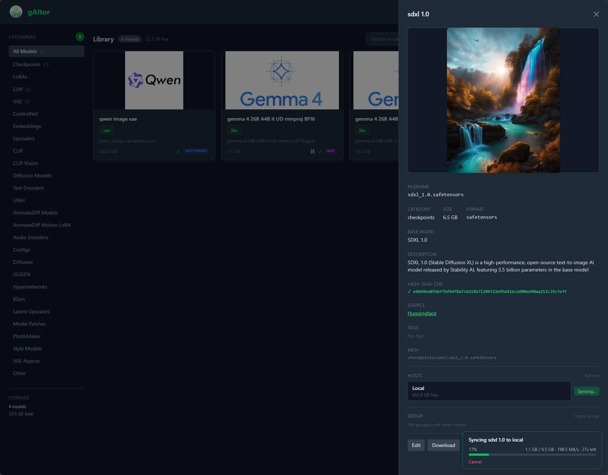
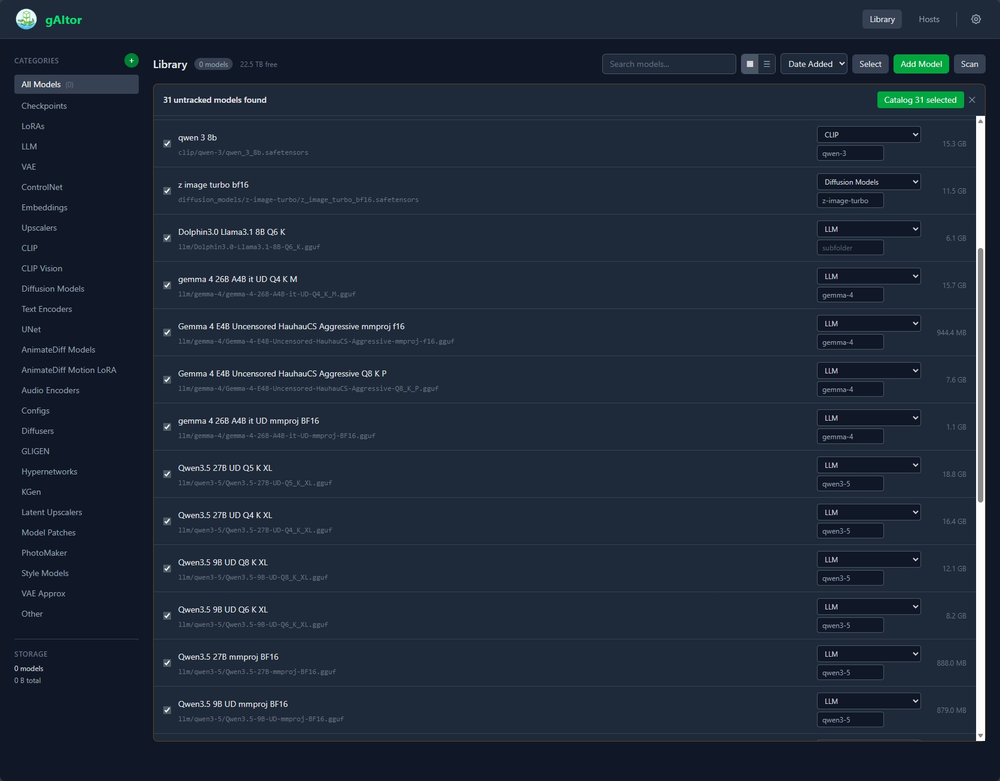
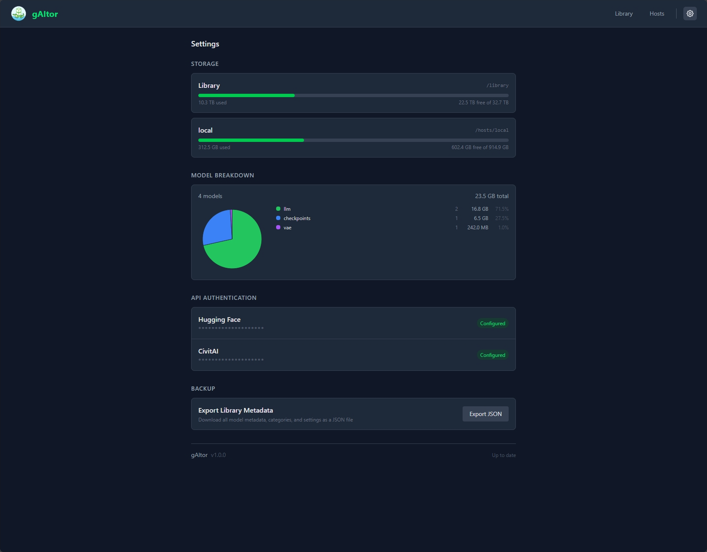

<p align="center">
  
</p>

# gAItor

AI local model asset manager and sync tool. A self-hosted, Docker-based web UI for managing AI model files across a **library** (NAS/source of truth) and one or more **hosts** (inferencing machines).

Think of it as a smart FTP specifically designed for AI models - browse, sync, retrieve from Hugging Face / CivitAI and other URL's, and deploy models across your local AI infrastructure.

<p align="center">
  
  
</p>
<p align="center">
  
  
</p>

## Features

- **Library Management** - Centralized model library with metadata, common categories, search, and tagging
- **Host Sync** - Copy models to inferencing machines with real-time progress tracking
- **External Retrieval** - Download models from Hugging Face, CivitAI and external locations directly into your library
- **Model Organization** - Rename models in the library, add descriptions and thumbnails, organize in folders and create groups of partner models
- **Web Upload & Scan** - Upload models through the browser or scan for files added directly to storage
- **File Integrity** - SHA-256 hashing for verifying large model file transfers
- **Docker Native** - Single container, volume mounts for library and hosts, PUID/PGID support for NAS

## Quick Start

```yaml
# docker-compose.yml
services:
  gaitor:
    image: ghcr.io/kernelkaribou/gaitor:latest
    container_name: gaitor
    environment:
      - PUID=1000
      - PGID=1000
      - TZ=America/Chicago
      # - HUGGINGFACE_TOKEN=hf_xxxxx
      # - CIVITAI_API_KEY=xxxxx
    ports:
      - "8487:8487"
    volumes:
      - /path/to/library/models:/library
      - /path/to/host/models:/hosts/local-gpu
      # Add more hosts as volume mounts under /hosts/:
      # - /mnt/laptop/models:/hosts/laptop
      # - /mnt/server2/models:/hosts/server2
    restart: unless-stopped
```

```bash
docker compose up -d
# Open http://localhost:8487
```

### Hosts

Hosts are auto-discovered from subdirectories under `/hosts/` inside the container. Each Docker volume mount creates a host that appears in the UI.

To add a host, mount the remote machine's model directory (via NFS, SMB, or local path) under `/hosts/<name>`:

```yaml
volumes:
  - /path/to/library/models:/library                  # Source of truth
  - /mnt/gpu-pc/models:/hosts/gpu-pc              # Host 1
  - /mnt/laptop/ai-models:/hosts/laptop           # Host 2
  - /mnt/render-node/models:/hosts/render-node    # Host 3
```

The folder name after `/hosts/` becomes the host name in the UI. Names are formatted for display: underscores become spaces and each word is capitalized (e.g. `gpu_workstation` → "Gpu Workstation", `render-node` → "Render-Node"). No configuration files are needed — just add or remove volume mounts and restart the container.

## Environment Variables

| Variable | Default | Description |
|----------|---------|-------------|
| `PUID` | `1000` | User ID for file operations |
| `PGID` | `1000` | Group ID for file operations |
| `TZ` | `Etc/UTC` | Timezone |
| `PORT` | `8487` | Web UI port |
| `LOG_LEVEL` | `INFO` | Logging level (DEBUG, INFO, WARNING, ERROR) |
| `HUGGINGFACE_TOKEN` | - | Hugging Face API token (for gated models) |
| `CIVITAI_API_KEY` | - | CivitAI API key |

## Development

### Prerequisites
- Python 3.12+
- Node.js 22+
- Docker (for container builds)

### Setup
```bash
# Backend
make setup-backend

# Frontend
make setup-frontend
```

### Run locally
```bash
# Backend (with hot reload)
make dev-backend

# Frontend (with hot reload, separate terminal)
make dev-frontend
```

### Docker development
```bash
make docker-dev
```

### Run tests
```bash
make test
```

## Architecture

- **Backend**: Python 3.12 + FastAPI
- **Frontend**: Svelte 5 + Vite + Tailwind CSS
- **Metadata**: JSON files (no database - network share friendly)
- **Transfers**: Server-side file copy between Docker volume mounts (browser only receives progress updates)

## Storage & Sidecar Files

gAItor stores all metadata as lightweight JSON files alongside your models — no database required. Here is what gets created and where, so you know exactly what to expect (and clean up) at the filesystem level.

### Library (`/library`)

All library metadata lives in a hidden `.gaitor/` directory at the library root. Your actual model files are never modified.

```
/library/
├── .gaitor/                        # All gAItor metadata lives here
│   ├── config.json                 # Library configuration and settings
│   ├── categories.json             # Category definitions (checkpoints, loras, etc.)
│   ├── models/                     # One JSON file per cataloged model
│   │   ├── <model-uuid>.json       # Name, description, source URL, tags, hash, path
│   │   └── ...
│   └── thumbnails/                 # Optional model thumbnail images
│       └── <model-uuid>.webp
├── checkpoints/
│   └── my-model.safetensors        # Actual model file (untouched)
└── loras/
    └── detail-enhancer.safetensors
```

To fully remove gAItor from your library, delete the `.gaitor/` directory. Your model files remain intact.

### Hosts (`/hosts/<host_id>`)

Each synced model on a host gets a hidden sidecar file placed next to it. This is how gAItor tracks which library model a file belongs to and detects renames, moves, or content changes.

```
/hosts/my-server/
├── checkpoints/
│   ├── my-model.safetensors              # Copied model file
│   └── .my-model.safetensors.gaitor.json # Sidecar metadata
└── .gaitor-ignore                        # Optional: patterns to exclude from scans
```

**Sidecar file** (`.{filename}.gaitor.json`) — created when a model is synced or linked:

```json
{
  "library_model_id": "abc-123-uuid",
  "library_name": "My Model",
  "library_relative_path": "checkpoints/my-model.safetensors",
  "current_filename": "my-model.safetensors",
  "synced_at": "2026-04-15T12:00:00Z",
  "hash": "sha256:abcdef..."
}
```

**`.gaitor-ignore`** — optional file at the host root, one pattern per line (fnmatch syntax). Files matching these patterns are excluded from host scans:

```
# Ignore application-generated files
*.bin
temp-models/*
```

To fully remove gAItor tracking from a host, delete all `.gaitor.json` sidecar files and the `.gaitor-ignore` file. Your model files remain intact.

## License

MIT - see [LICENSE](LICENSE)

## Disclosure

It may surprise you I built a local AI model management tool with AI but I did. I had this idea as I was messing with local AI models and passing them across a few machines and wanted a better way to manage it. I did not write the code, ai did, I gave it the idea. I plan to update and keep it functioning as long as I use it and tweak features here and there but its pretty defined scope tool that already went a little overboard. You can do whatever you want with this tool, I dont care. Maybe someone will make something better after seeing this...or already has.